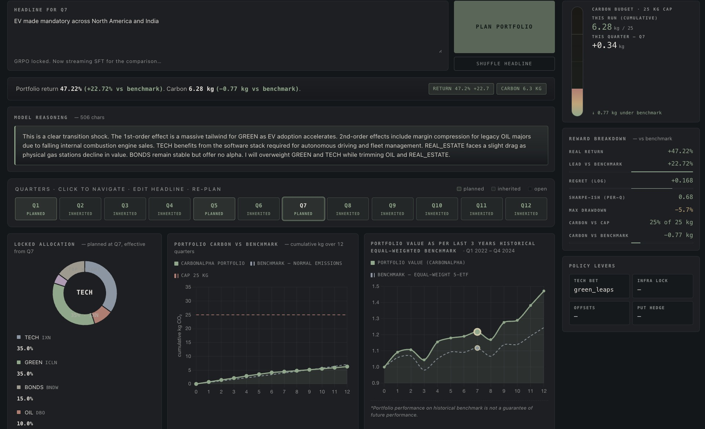
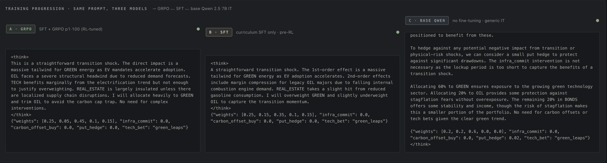
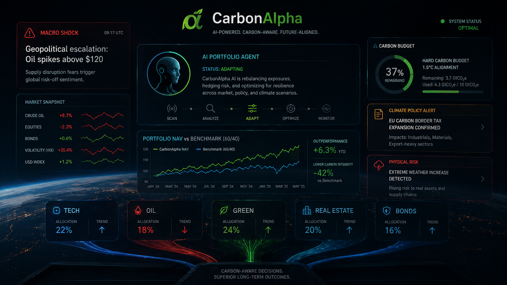
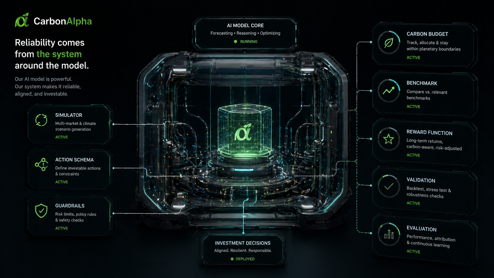
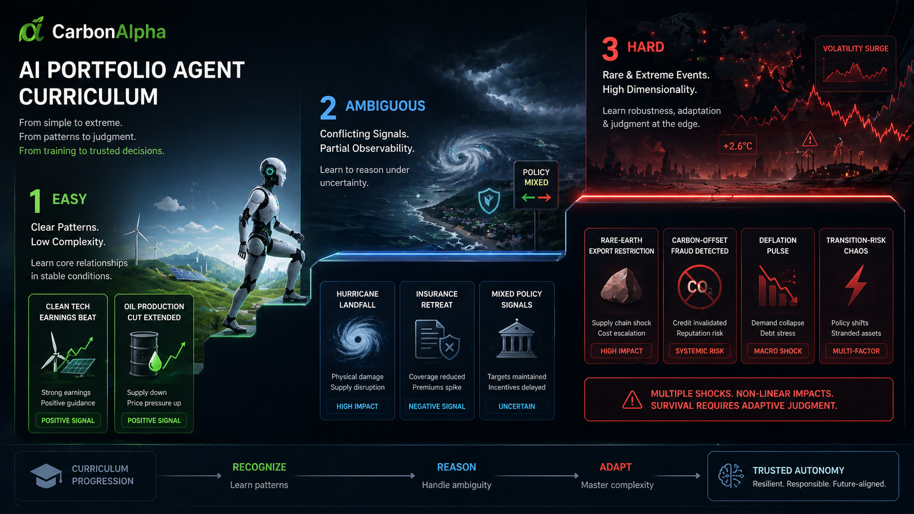
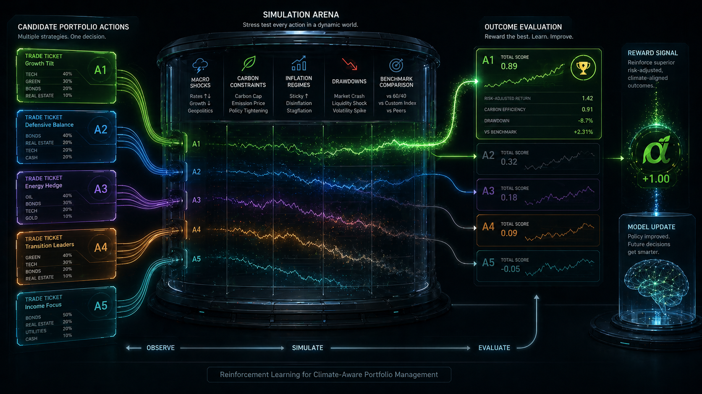
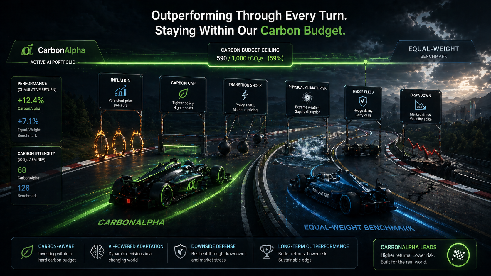

# CarbonAlpha: Teaching a 7B Model to Manage a Carbon-Budgeted Portfolio Through Macro Shocks



*The live CarbonAlpha demo: edit a macro headline, re-plan from that quarter, and watch allocation, carbon budget, NAV, and reward components move together.*

## Submission Links

- Live demo Space: [77ethers-carbonalpha-demo.hf.space](https://77ethers-carbonalpha-demo.hf.space/)
- Hugging Face Space repo: [huggingface.co/spaces/77ethers/CarbonAlpha-demo](https://huggingface.co/spaces/77ethers/CarbonAlpha-demo)
- Hugging Face model repo: [huggingface.co/77ethers/CarbonAlpha](https://huggingface.co/77ethers/CarbonAlpha)
- Final GRPO adapter: [grpo_qwen25_7b_adapter_phase1_100_v1](https://huggingface.co/77ethers/CarbonAlpha/tree/main/grpo_qwen25_7b_adapter_phase1_100_v1)
- SFT warm-start adapter: [sft_qwen25_7b_curriculum400_v1](https://huggingface.co/77ethers/CarbonAlpha/tree/main/sft_qwen25_7b_curriculum400_v1)
- Training dataset repo: [huggingface.co/datasets/77ethers/CarbonAlpha-train](https://huggingface.co/datasets/77ethers/CarbonAlpha-train)
- Final Colab notebook: [carbonalpha_final_pipeline.ipynb](https://colab.research.google.com/github/capabl-machines/gridops/blob/round-2/notebooks/carbonalpha_final_pipeline.ipynb)
- GitHub branch: [capabl-machines/gridops/tree/round-2](https://github.com/capabl-machines/gridops/tree/round-2)
- Model card: [README.md on Hugging Face](https://huggingface.co/77ethers/CarbonAlpha/blob/main/README.md)
- Training evidence: [loss plot](https://huggingface.co/77ethers/CarbonAlpha/blob/main/assets/loss_curve.png), [reward plot](https://huggingface.co/77ethers/CarbonAlpha/blob/main/assets/reward_curve.png), [raw GRPO log](https://huggingface.co/77ethers/CarbonAlpha/blob/main/training_logs/qwen25_grpo_phase1_100_v1.log)

## Why This Problem

ESG-mandated capital is now measured in tens of trillions, and the mandates are getting teeth.

"Carbon-budgeted" portfolios — where the manager has a hard cap on realized portfolio carbon intensity, not just a soft preference — are moving from voluntary to contractual. At the same time, the macro environment that drives sector rotation has become almost entirely climate-adjacent: CBAM, IRA, COP outcomes, physical climate shocks, energy-driven inflation, transition-risk repricings.

Two problems collide here:

A human PM cannot consistently reason through 1st, 2nd, and 3rd-order effects of every macro headline through a carbon-aware lens, every quarter, across every position. The reasoning is doable; the consistency is not.

And a generic LLM with a clever prompt cannot do it either — not reliably. It hallucinates carbon intensities, drifts from the action schema, ignores the budget constraint when the news is exciting, and has no notion of regret against a benchmark.

CarbonAlpha is our attempt to build the missing thing: a small, fine-tuned, RL-trained reasoning agent that lives inside a real portfolio environment with a real carbon budget, and learns to allocate through it.

## The Core Bet

CarbonAlpha is not a price predictor.

It does not try to forecast the exact return of oil, bonds, green equities, real estate, or technology stocks next quarter. Instead, it learns a more constrained skill: given a macro headline, produce a portfolio thesis that can survive a simulated macro path.

The model has to answer questions like:

- Is this headline noise, a temporary shock, or the beginning of a regime shift?
- Which asset gets hit directly?
- Which asset benefits from second-order capital rotation?
- Does the carbon budget make the obvious trade impossible?
- Is a hedge justified, or is it expensive panic?
- Does the decision beat a simple equal-weight benchmark?

That last point matters. A model that sounds smart but loses to equal-weight is not useful. CarbonAlpha is scored against a benchmark, under a carbon cap, inside a path-dependent environment.

## From Prompt to Harness

The AI world is moving from "just use a bigger model" toward **agent harnesses**: the runtime systems around a model that manage state, tools, guardrails, execution, and evaluation.

Salesforce describes an agent harness as the operational layer that manages tools, memory, and safety around an AI system. Other recent writing on harness engineering makes the same point in engineering terms: reliability increasingly comes from the surrounding system — verification, tracing, stop conditions, retries, and measurable outcomes — not just from swapping in a stronger model.

CarbonAlpha is best understood in that language.

The model is the reasoner. The **portfolio harness** is everything around it:

- the OpenEnv simulator;
- the action schema;
- the carbon budget;
- the equal-weight benchmark;
- the reward functions;
- the holdout seeds;
- the macro eval set;
- the quarter-by-quarter demo runtime.

This matters because finance is full of outputs that can sound intelligent but are not executable. A model can write a beautiful macro memo and still produce an invalid trade, violate the carbon mandate, or lose to a naive benchmark.

The harness makes the model answerable to consequences.

In that sense, CarbonAlpha is not just a fine-tuned LLM. It is an **evaluation harness for carbon-aware portfolio reasoning** and a **training harness for turning macro theses into scored actions**.

## The Environment

We built CarbonAlpha as an OpenEnv environment.

The agent receives macro news and emits one structured `PortfolioAction`:

```json
{
  "weights": [w_tech, w_oil, w_green, w_real_estate, w_bonds],
  "infra_commit": 0.0,
  "carbon_offset_buy": 0.0,
  "put_hedge": 0.0,
  "tech_bet": "status_quo"
}
```

The five assets are:

```text
TECH, OIL, GREEN, REAL_ESTATE, BONDS
```

The environment then evaluates the decision over a 12-quarter macro path. This is not meant to claim that real portfolio managers never rebalance. The point is to test whether the model's macro thesis is durable as the initial shock fades, compounds, or turns into a regime.

The simulator tracks:

- real NAV versus an equal-weight benchmark;
- accumulated portfolio carbon;
- inflation regimes;
- transition shocks;
- physical climate shocks;
- transaction costs;
- hedge bleed;
- infrastructure lockups;
- drawdowns.

This gives us something a prompt alone cannot provide: consequences.

## The Shock Curriculum

The shock pool is split into three tiers.

Easy shocks test first-order reasoning. A clean tech earnings beat should usually help TECH. A modest OPEC production cut should usually help OIL. A green subsidy should usually help GREEN.

Ambiguous shocks test conflicting signals. A hurricane can hurt real estate, lift oil through refinery disruption, and also increase green reconstruction demand. An insurance retreat from coastal property markets can hurt real estate while strengthening the adaptation narrative.

Hard shocks test second- and third-order reasoning. A rare-earth export restriction sounds like a climate transition story, but it can hurt GREEN supply chains and rotate capital into OIL. A deflation pulse can make BONDS the only asset with positive real protection. A carbon-offset fraud scandal can destroy voluntary offset prices while rewarding real abatement assets.

This shock structure became both the environment curriculum and the data curriculum.

## The Training Dataset

The training data was not just a bag of examples. We built it as a curriculum.

The final SFT dataset used for the strongest Qwen2.5 model was:

```text
sft_traces/curriculum_400_e80_m160_h160.jsonl
```

It contains 400 traces:

```text
80 easy
160 medium / ambiguous
160 hard
```

Each trace follows the same schema as the earlier aligned dataset:

```text
sft_traces/merged_v6_aligned.jsonl
```

Each row stores:

- an `id`;
- seed metadata;
- the exact prompt;
- the target completion;
- a `raw` object with the news event, reasoning, action fields, and curriculum metadata.

The completion always follows the model contract:

```text
<think>
macro-cycle reasoning
</think>
{"weights": [...], "infra_commit": ..., "carbon_offset_buy": ..., "put_hedge": ..., "tech_bet": "..."}
```

This matters because format is not cosmetic. If the model cannot produce valid JSON, the environment cannot execute the action. If the reasoning is unbounded, the model wastes token budget and often fails to close the action. If the prompt used in trace generation differs from the prompt used in inference, the model learns the wrong distribution.

So `portfolio_env/prompt.py` became the single source of truth. The same prompt is used for:

- trace generation;
- SFT training;
- GRPO prompts;
- holdout evaluation;
- demo inference.

## How We Generated the Curriculum

The curriculum traces were generated with Gemini using a controlled batch process.

The generator asks for 10 traces per API call and rotates across API keys. It validates every trace before accepting it. Bad rows are written to failure files rather than silently entering the dataset.

The easy / medium / hard labels are not vibes. They map directly to the environment's shock tiers:

```text
easy   -> Shock.tier == "easy"      -> Phase 1
medium -> Shock.tier == "ambiguous" -> Phase 2
hard   -> Shock.tier == "hard"      -> Phase 3
```

This gives the dataset a clean pedagogical shape:

1. Teach the model the obvious first-order cases.
2. Add ambiguous cases where the headline contains mixed signals.
3. Add hard cases where the profitable move is often counterintuitive.

We intentionally over-sampled medium and hard cases. Easy cases teach format and base-rate behavior, but the demo lives or dies on ambiguous macro news.

## Dataset Examples

The curriculum is easiest to understand through examples.

An easy trace might look like:

```text
News:
Routine earnings season. Tech majors beat estimates by 2.8% on average.
Bond yields steady. No macro surprises.

What the model should learn:
This is not a regime shift. TECH gets the first-order benefit, but there is
no reason to buy expensive hedges or make a huge carbon-heavy rotation.
```

The target allocation should usually tilt toward TECH while keeping a
diversified base-rate posture. This teaches the model not to overreact.

An ambiguous trace might look like:

```text
News:
Three top-10 US insurers exit Florida and California property markets citing
climate-loss economics. State regulators hint at taxpayer-backed reinsurance.
Treasury yields fall on flight-to-quality.

What the model should learn:
REAL_ESTATE is directly hurt by insurance withdrawal, but BONDS may benefit
from falling yields. GREEN/adaptation may benefit narratively, but the model
should not blindly put everything into GREEN.
```

This kind of trace teaches conflict resolution. The same headline contains a
physical-risk signal, a policy backstop signal, and a rates signal.

A hard trace might look like:

```text
News:
China announces an 80% reduction in rare-earth exports over 18 months.
Renewable manufacturers warn of three quarters of supply-chain disruption.
Oil majors announce record buybacks on sector-rotation inflows.

What the model should learn:
The naive climate reading is "buy GREEN." The better macro-cycle reading is
that GREEN supply chains can be impaired, TECH can be hit by export controls,
and OIL/BONDS may benefit from rotation and defensiveness.
```

This is the kind of example that justifies training rather than prompting. A
generic model often keys off the climate language and buys GREEN. A trained
model should ask whether the green trade is operationally bottlenecked.

Another hard trace:

```text
News:
Two ratings agencies find 40% of voluntary carbon offsets invalid. Voluntary
offset prices collapse, but EU CBAM regulators announce retroactive audits and
compliance credit prices spike.

What the model should learn:
Not all carbon assets are the same. Voluntary offsets can collapse while real
abatement assets and compliance-driven GREEN projects rerate upward. OIL faces
higher compliance pressure.
```

This teaches the distinction between a carbon-market headline and a
carbon-pricing regime. That distinction is central to portfolio behavior.

Each trace is doing more than giving the model an answer. It is teaching a
repeatable pattern:

```text
headline -> causal decomposition -> constrained allocation -> executable JSON
```

## What a Good Trace Teaches

A good CarbonAlpha trace does three jobs at once.

First, it teaches the output contract. The model learns to close `<think>`, emit one JSON object, keep weights bounded, and avoid markdown wrappers.

Second, it teaches causal decomposition. The reasoning should identify:

- first-order direct asset effects;
- second-order capital-flow or policy effects;
- third-order counterintuitive risks.

Third, it teaches portfolio discipline. The completion should explain why the allocation survives the carbon cap, why hedges are or are not justified, and why the decision has a chance to beat the equal-weight baseline.

This is very different from generic finance QA. The model is not answering "what does this news mean?" It is producing an executable allocation under constraints.

## Why Prompting Was Not Enough

A generic LLM can produce a plausible investment memo. That is not the same as producing a valid portfolio action.

We saw recurring failure modes:

- malformed JSON;
- weights that do not sum cleanly;
- excessive hedging;
- carbon-budget violations;
- overreaction to climate-positive language;
- buying GREEN in every climate headline;
- missing cases where OIL is the first-order beneficiary;
- treating all carbon-market news as directionally identical.

The model needed to learn both the language of macro reasoning and the mechanics of the environment.

## SFT: Teaching the Contract

We first trained with supervised fine-tuning.

The best SFT warm-start was:

```text
77ethers/CarbonAlpha/sft_qwen25_7b_curriculum400_v1
```

It used:

```text
unsloth/Qwen2.5-7B-Instruct
```

with QLoRA, LoRA rank 16, and the 400-trace curriculum.

SFT gave the model the basic grammar of the task. It learned what a valid answer looks like: bounded reasoning, valid JSON, plausible weights, and carbon-aware language.

But SFT alone only imitates examples. It does not know whether an allocation actually performs well in the environment.

That is where GRPO comes in.

## GRPO: Turning Portfolio Performance Into Feedback

GRPO lets the model sample multiple candidate completions for the same macro prompt, score them, and update toward the completions that perform better.

For CarbonAlpha, this is powerful because the reward is not a vague preference score. It is tied to portfolio behavior.

The reward stack connects directly to portfolio management:

| Reward | Portfolio Meaning |
|---|---|
| Format reward | Did the model produce an executable trade ticket? |
| Action-contract reward | Are weights and interventions valid, bounded, and non-degenerate? |
| Regret reward | Did the portfolio beat equal-weight on real return? |
| Carbon guard | Did it respect the carbon mandate? |
| Drawdown / risk terms | Did it survive the path, not just chase upside? |
| Reasoning-shape reward | Did it produce a concise investment thesis rather than rambling? |

This is the core engineering move: the model is not rewarded for sounding like a portfolio manager. It is rewarded for producing actions that survive the simulator.

## Why Regret Is the Right Financial Signal

Raw return is not enough. If every asset rises, a model can look good by accident.

CarbonAlpha uses regret against an equal-weight benchmark. In portfolio terms, that means the model is rewarded for incremental decision quality:

```text
agent real return - equal-weight real return
```

This keeps the task honest. The model has to beat a simple diversified baseline after inflation, not just produce positive nominal return in an easy path.

The carbon constraint makes this harder. OIL can be the correct macro trade under some inflationary shocks, but it emits heavily. The model must decide when the return premium is worth the carbon cost, and when the carbon budget makes the trade impossible.

## The Best Model

Our best current research model is:

```text
Qwen2.5-7B-Instruct
+ SFT on 400 curriculum traces
+ 100 Phase-1 GRPO steps
```

Artifact:

```text
77ethers/CarbonAlpha/grpo_qwen25_7b_adapter_phase1_100_v1
```

On holdout seeds:

```text
5/5 valid actions
mean holdout regret: +0.1058
beats baseline: 5/5
```

We also tested a Qwen3-4B-Base branch. It passed the mechanical GRPO smoke gate, but did not beat the Qwen2.5 model. So for the demo, Qwen2.5-7B remains the stronger candidate.

## How We Evaluated It

We used three evaluation layers because no single metric tells the whole story.

Training curves answer one question: did training actually happen, and did it stay numerically healthy?

Holdout simulation answers a second question: did the produced allocation beat the environment benchmark on unseen seeds?

Manual macro eval answers a third question: does the model reason sensibly on human-readable macro events, including tricky second-order cases?

### 1. GRPO Smoke Gate

Before scaling any GRPO run, we used a smoke gate.

The model had to satisfy:

- completions were not collapsed to one token;
- mean completion length stayed above 50 tokens;
- `grad_norm` was nonzero and non-NaN;
- at least one reward component had nonzero standard deviation;
- at least 3/5 sanity completions parsed into valid `PortfolioAction`;
- post-GRPO generations still closed `<think>` and emitted JSON.

This gate exists because our earlier GRPO attempts failed in a very specific way: the model generated one-token completions, reward variance went to zero, and the trainer reported no real learning signal. A reward curve is meaningless if the rollout distribution is broken.

The successful Qwen2.5 100-step run passed this gate. Its completion lengths stayed in the normal 100+ token range, gradients stayed alive, and reward variance came from the simulator regret component.

### 2. Holdout Seeds

The main quantitative eval uses fixed holdout seeds:

```text
100, 200, 300, 400, 500
```

These seeds are reserved for evaluation and excluded from training sampling.

For each seed:

1. The environment selects a phase-3 shock.
2. The model reads the shock news.
3. The model emits a `PortfolioAction`.
4. The environment simulates the macro path.
5. We compute regret against the equal-weight benchmark.

This gives us an apples-to-apples measure of decision quality:

```text
model real return - equal-weight real return
```

The best GRPO model produced:

| Metric | Result |
|---|---:|
| Valid actions | 5/5 |
| Mean holdout regret | `+0.1058` |
| Beats benchmark | 5/5 |
| Previous v6 SFT bar | `+0.034` |

Per-seed results:

| Seed | Shock | Regret |
|---:|---|---:|
| 100 | `hard_rare_earth_rotation` | `+0.0755` |
| 200 | `easy_tech_earnings` | `+0.1210` |
| 300 | `easy_tech_earnings` | `+0.1442` |
| 400 | `hard_deflation_pulse` | `+0.1527` |
| 500 | `ambig_ai_efficiency` | `+0.0358` |

This is the metric that tells us the model's actions improved inside the simulator.

### 3. Manual Macro Eval

Simulator holdout is necessary, but not sufficient.

A model can score well on a small holdout and still fail when a user gives it a realistic macro headline. So we built a 10-question manual eval set:

```text
evals/macro_eval_10.jsonl
```

The eval covers:

- benign disinflation and productivity;
- oil chokepoint inflation;
- commercial real-estate credit stress;
- AI efficiency paradox;
- carbon-offset fraud;
- rare-earth export controls;
- insurance retreat from climate-risk states;
- global deflation pulse;
- crypto policy noise;
- yen carry unwind.

Each eval item includes:

- the macro question;
- expected reasoning focus;
- red flags.

The report is saved at:

```text
evals/macro_eval_10_grpo_report.json
```

The GRPO model produced:

```text
10/10 valid JSON actions
10/10 closed <think> blocks
```

It was clearly stronger than base Qwen on hard macro cases such as rare-earth export controls, global deflation, and yen carry unwind.

This eval also caught the two weaknesses we still care about:

- it underweighted OIL in a direct oil chokepoint supply shock;
- it overweighted GREEN in an AI efficiency shock where lower data-center power demand should hurt renewable buildout economics.

That is useful. It tells us exactly what the next traces and rewards should target.

### 4. What the Plots Prove

The loss and reward plots are evidence that real training happened.

They show:

- 100 actual GRPO metric rows from the HF Job log;
- finite loss;
- nonzero gradients;
- nonzero reward variance;
- stable completion lengths;
- no one-token collapse.

But the plots do not prove the model is a good portfolio reasoner by themselves.

They are health checks. The real performance claim comes from the holdout regret and macro eval.

That is why the model card includes all three:

- training plots;
- holdout metrics;
- manual eval results.

## What the Demo Shows

The demo is designed to make the training delta visible.

You can choose or edit a macro headline, then click **Plan Portfolio**. CarbonAlpha reasons live and produces an allocation.

The interface shows:

- model reasoning;
- portfolio weights;
- carbon budget;
- NAV versus benchmark;
- reward breakdown;
- quarter-by-quarter path;
- side-by-side comparison between model versions.

The important thing is not just the final answer. It is watching how the trained model changes behavior compared with the warm-start and base model.

A base model may produce plausible prose. The trained model is more likely to produce a valid action that respects the environment.



*The demo also exposes the training progression directly: GRPO, SFT, and base Qwen answer the same macro prompt side by side.*

## What Still Fails

The model is not perfect, and the eval caught useful weaknesses.

In an oil chokepoint shock, the model understood inflation and hedging, but underweighted OIL despite the direct supply shock.

In an AI efficiency shock, the model correctly liked TECH and cut REAL_ESTATE, but still gave GREEN too much weight even though lower data-center power demand should hurt renewable buildout economics.

These are exactly the kinds of failures we want the environment to reveal. They give us targeted next steps: more traces and sharper rewards for energy supply shocks and AI-efficiency second-order effects.

## Why This Matters

Carbon-aware investing is not just "prefer green assets."

Sometimes the climate-positive trade is crowded. Sometimes transition infrastructure wins. Sometimes the carbon constraint blocks the highest-return trade. Sometimes a green headline hurts green supply chains. Sometimes the best carbon-aware move is defensive.

That is why CarbonAlpha is trained inside an environment.

The broader lesson is simple: for constrained decision-making, prompts are not enough. The model needs a world with rules, consequences, baselines, and rewards.

CarbonAlpha is one version of that idea: a small reasoning model trained to manage a carbon-budgeted portfolio through macro shocks, not by sounding smart, but by being scored on what its decisions do.

## References on the Harness Framing

- Salesforce, ["Agent Harness: The Infrastructure for Reliable AI"](https://www.salesforce.com/agentforce/ai-agents/agent-harness/)
- Future of Being Human, ["What we miss when we talk about AI Harnesses"](https://www.futureofbeinghuman.com/p/what-we-miss-when-we-talk-about-ai-harnesses)
- rmax.ai, ["Harness Engineering Is the Primary Lever for Agent Reliability in 2025-2026"](https://rmax.ai/notes/harness-new-model-agent-systems-2026/)

## Visual Appendix

The images below are AI-generated concept visuals used to explain the system narrative. The real demo screenshots are shown at the top of the blog and in the demo section above.



*Concept 1: CarbonAlpha as a live portfolio agent.*



*Concept 2: the harness around the model.*



*Concept 3: the easy, ambiguous, and hard curriculum.*



*Concept 4: GRPO as a simulation arena for candidate allocations.*



*Concept 5: the target behavior: outperform while staying inside the carbon budget.*
