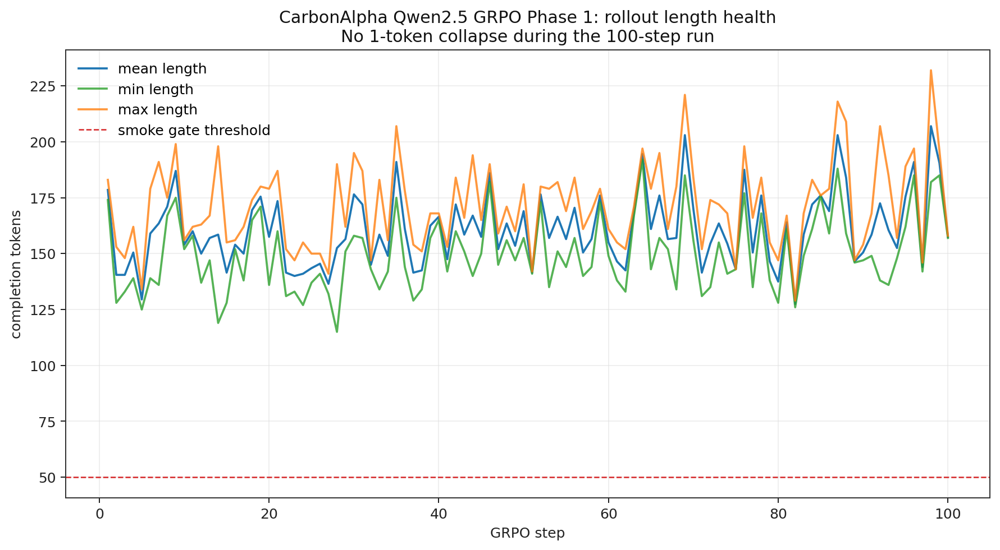

---
language:
- en
library_name: peft
base_model: unsloth/Qwen2.5-7B-Instruct
tags:
- grpo
- trl
- peft
- qwen2.5
- openenv
- portfolio-reasoning
- climate
license: other
pipeline_tag: text-generation
---

# CarbonAlpha Model Card

## Model Summary

CarbonAlpha is a climate-aware portfolio reasoning agent for the
`portfolio_env` OpenEnv environment. It reads one macro-news event, reasons
through first-order and second-order effects, and emits a constrained
`PortfolioAction`:

```json
{
  "weights": [w_tech, w_oil, w_green, w_real_estate, w_bonds],
  "infra_commit": 0.0,
  "carbon_offset_buy": 0.0,
  "put_hedge": 0.0,
  "tech_bet": "status_quo"
}
```

Current best research model:

```text
77ethers/CarbonAlpha/grpo_qwen25_7b_adapter_phase1_100_v1
```

Base model:

```text
unsloth/Qwen2.5-7B-Instruct
```

Adapter lineage:

1. SFT warm-start on 400 curriculum traces.
2. GRPO Phase 1 for 100 steps.
3. Holdout and manual macro-eval checks before promotion.

The live Space can load this adapter through the `MODEL_SUBFOLDER`
environment variable:

```text
https://77ethers-carbonalpha-demo.hf.space/
```

## Intended Use

This model is intended for the CarbonAlpha walkthrough demo and OpenEnv
evaluation. It is not a financial advisor and should not be used to make real
investment decisions.

The useful behavior to evaluate is:

- strict `<think>...</think>` plus JSON formatting;
- valid portfolio weights and bounded interventions;
- recognition of macro regime shifts;
- carbon-budget awareness;
- performance against the environment's equal-weight baseline.

## Training Data

The Qwen2.5 SFT warm-start used:

```text
sft_traces/curriculum_400_e80_m160_h160.jsonl
```

Trace mix:

- 80 easy traces;
- 160 medium / ambiguous traces;
- 160 hard traces.

The trace schema follows `sft_traces/merged_v6_aligned.jsonl`, with the same
prompt and completion contract used during inference.

## Training Pipeline

### SFT

SFT artifact:

```text
77ethers/CarbonAlpha/sft_qwen25_7b_curriculum400_v1
```

Training script:

```text
scripts/hf_sft_qwen25_7b.py
```

Configuration:

- QLoRA over `unsloth/Qwen2.5-7B-Instruct`;
- LoRA rank 16;
- `lora_alpha=16`;
- 220 SFT steps;
- effective batch size 4;
- Hugging Face Jobs L40S.

SFT result:

- generation sanity: 5/5 valid actions;
- holdout: 5/5 valid;
- mean holdout regret: `+0.02796`;
- beats baseline on 3/5 holdout seeds.

### GRPO

Best GRPO artifact:

```text
77ethers/CarbonAlpha/grpo_qwen25_7b_adapter_phase1_100_v1
```

Training script:

```text
scripts/hf_grpo_qwen25_adapter.py
```

GRPO configuration:

- warm-start from `sft_qwen25_7b_curriculum400_v1`;
- `use_vllm=False`;
- 100 GRPO steps;
- 128 generated Phase-1 prompts;
- 2 generations per prompt;
- batch size 2;
- learning rate `2e-6`;
- `loss_type="dapo"`;
- KL beta `0.02`.

Reward functions:

- format reward;
- action-contract reward;
- reasoning-shape reward;
- Phase-1 simulator regret reward;
- carbon-guard reward.

Important engineering choice: we avoided vLLM for the Qwen2.5 GRPO run because
earlier vLLM-based Qwen3 rollouts collapsed to one-token completions. The
plain-Transformers path was slower but healthier and easier to debug.

## Evidence of Training

The 100-step GRPO run was launched as a Hugging Face Job:

```text
https://huggingface.co/jobs/77ethers/69ed1ce0d70108f37acdeea3
```

Raw evidence committed in this repo:

```text
training_logs/qwen25_grpo_phase1_100_v1.log
training_logs/qwen25_grpo_phase1_100_v1_rows.jsonl
```

The parsed JSONL contains 100 real GRPO metric rows extracted from the job log.

Loss and reward plots generated from those rows:


Additional rollout-health plot:



The completion-length plot is included because one-token rollout collapse was
the main failure mode in earlier GRPO attempts. In this successful run,
completion lengths stayed well above the smoke threshold throughout training.

## Evaluation

### Holdout

Holdout seeds:

```text
100, 200, 300, 400, 500
```

Best GRPO holdout results:

| Metric | Value |
|---|---:|
| Valid completions | 5/5 |
| Mean holdout regret | `+0.1058` |
| Beats baseline | 5/5 |
| Previous v6 SFT mean regret bar | `+0.034` |

Per-seed holdout:

| Seed | Shock | Regret |
|---:|---|---:|
| 100 | `hard_rare_earth_rotation` | `+0.0755` |
| 200 | `easy_tech_earnings` | `+0.1210` |
| 300 | `easy_tech_earnings` | `+0.1442` |
| 400 | `hard_deflation_pulse` | `+0.1527` |
| 500 | `ambig_ai_efficiency` | `+0.0358` |

### Manual Macro Eval

Eval set:

```text
evals/macro_eval_10.jsonl
```

Report:

```text
evals/macro_eval_10_grpo_report.json
```

Summary:

- GRPO adapter: 10/10 valid JSON actions;
- GRPO adapter: 10/10 closed `<think>`;
- base model: 9/10 valid JSON actions;
- GRPO was stronger on rare-earth export controls, global deflation pulse, and
  yen carry unwind.

Known weaknesses:

- `q02_oil_chokepoint_inflation`: the model understood the inflation regime
  and hedged, but underweighted OIL despite the direct supply shock.
- `q04_ai_efficiency_paradox`: the model correctly liked TECH and cut
  REAL_ESTATE, but gave GREEN too much weight despite lower data-center power
  demand expectations.

These are targeted follow-up items, not hidden failures.

## Comparison With Qwen3 Base Branch

We also tested an isolated Qwen3-4B-Base branch:

```text
77ethers/CarbonAlpha/grpo_qwen3_4b_base_smoke_v2
```

Result:

- smoke gate passed mechanically;
- no one-token collapse;
- completions were too long, often near the 400-token cap;
- holdout: 4/5 valid;
- mean holdout regret: `-0.0229`;
- did not beat the Qwen2.5 GRPO model.

Conclusion: Qwen3 Base is a viable research branch, but the current production
candidate remains Qwen2.5-7B SFT plus GRPO.

## Limitations

- The GRPO run is Phase 1 only, so it is strongest on easy-shock simulator
  reward optimization.
- The model still has known second-order reasoning weaknesses in specific
  macro setups.
- The reward environment is synthetic and should be interpreted as a benchmark,
  not a market simulator.
- The model is private on Hugging Face and requires `HF_API_TOKEN` for loading.

## Reproducibility

Final notebook:

```text
notebooks/carbonalpha_final_pipeline.ipynb
```

Colab link:

```text
https://colab.research.google.com/github/capabl-machines/gridops/blob/round-2/notebooks/carbonalpha_final_pipeline.ipynb
```

The notebook verifies artifacts, loads metrics from Hugging Face, runs an
environment smoke test, shows the manual eval set, and includes opt-in cells
to relaunch the exact HF Jobs training runs.
