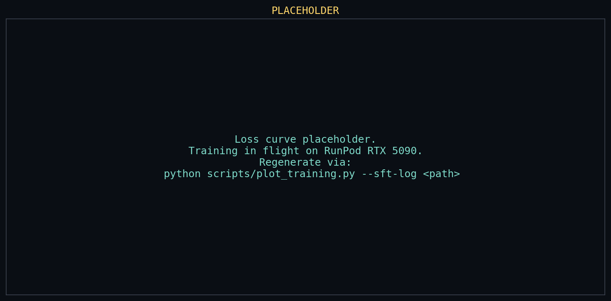
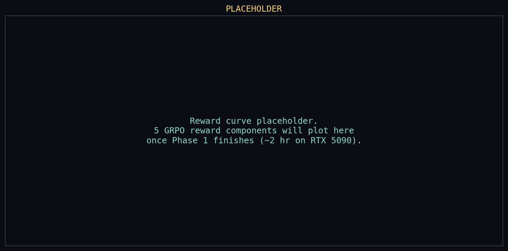

# Reasoning-Under-Constraints OpenEnv

**Meta PyTorch × Scaler OpenEnv Hackathon · April 25–26, 2026 · Bangalore**

An OpenEnv environment that trains LLMs to reason about **competing constraints under ambiguous signals and path-dependent decisions**. We flatten a 12-quarter portfolio-manager MDP into a single-turn prompt-completion task, then use SFT and GRPO to teach the model to connect news to causal reasoning to a constrained portfolio action.

**Team:** Ekansh + brother
**Themes:** #3.1 World Modeling · #2 Long-Horizon · #5 Wild Card

---

## Hackathon deliverables (compliance check)

| # | Required | Where |
|---|---|---|
| 1 | Public, cloneable HF Space | [`77ethers-carbonalpha-demo.hf.space`](https://77ethers-carbonalpha-demo.hf.space/) |
| 2 | OpenEnv `Environment` base class + `openenv.yaml` | [portfolio_env/env.py](portfolio_env/env.py) (PortfolioEnv inherits from `openenv.core.env_server.interfaces.Environment`) · [openenv.yaml](openenv.yaml) |
| 3 | Loss curve + reward curve as committed PNGs | [assets/loss_curve.png](assets/loss_curve.png) · [assets/reward_curve.png](assets/reward_curve.png) |
| 4 | Runnable training script (Colab preferred) | [Open final Colab](https://colab.research.google.com/github/capabl-machines/gridops/blob/round-2/notebooks/carbonalpha_final_pipeline.ipynb) · [notebooks/carbonalpha_final_pipeline.ipynb](notebooks/carbonalpha_final_pipeline.ipynb) |
| 5 | Short writeup / mini-blog | [BLOG_CARBONALPHA.md](BLOG_CARBONALPHA.md) |
| 6 | README with inline plots + every-deliverable links | this file |

### Loss curve



### Reward curve



Training evidence, raw job logs, metrics, limitations, and model lineage are
documented in [MODEL_CARD.md](MODEL_CARD.md).

---

## What we built in one paragraph

A 12-quarter (3-year bull-bear cycle) portfolio environment where the LLM reads a macro news headline with conflicting 1st/2nd/3rd-order causal hooks, emits `<think>` reasoning + a JSON action containing 5 portfolio weights and 4 optional interventions (infra_commit lockup, carbon_offset_buy, put_hedge, tech_bet thesis). Path-dependent physics (transaction costs, locked capital, accumulated carbon, inflation regime) tie one locked allocation to the full 3-year outcome. Episode reward is built from verifiable components: format compliance, regret-vs-equal-weighted-baseline on inflation-adjusted real returns, risk/carbon/drawdown penalties, and action validity. The best current research model is Qwen2.5-7B-Instruct SFT on 400 curriculum traces, then 100 Phase-1 GRPO steps. Adversarial pre-training stress-tests repaired reward exploits before model optimization. Hold-out seeds are reserved for clean generalization measurement.

---

## Repo map

| Path | What it is |
|---|---|
| **[MASTER_UNDERSTANDING.md](MASTER_UNDERSTANDING.md)** | **Read this first.** Single canonical narrative — what we're building in OpenEnv terms + every design decision with its rationale |
| [BLOG_CARBONALPHA.md](BLOG_CARBONALPHA.md) | Submission mini-blog: problem, environment, dataset curriculum, GRPO, evals |
| [MODEL_CARD.md](MODEL_CARD.md) | Model lineage, real training evidence, plots, metrics, limitations |
| [portfolio_env/](portfolio_env/) | The OpenEnv package |
| └── [env.py](portfolio_env/env.py) | `PortfolioEnv(Environment)` — reset/step/state/get_metadata |
| └── [models.py](portfolio_env/models.py) | `PortfolioAction(Action)`, `PortfolioObs(Observation)`, `PortfolioState(State)` |
| └── [shocks.py](portfolio_env/shocks.py) | 17-shock pool with 3-tier difficulty taxonomy |
| └── [rewards.py](portfolio_env/rewards.py) | 5 composite reward functions for GRPO |
| └── [inflation.py](portfolio_env/inflation.py) | Regime dynamics + real-return math |
| └── [sampling.py](portfolio_env/sampling.py) | Hold-out seed isolation |
| └── [server/app.py](portfolio_env/server/app.py) | FastAPI app via `openenv.core create_app` |
| [openenv.yaml](openenv.yaml) | HF Space deployment spec |
| [Dockerfile](Dockerfile) | Container build for HF Spaces |
| [tests/test_adversarial.py](tests/test_adversarial.py) | Pre-training reward stress-test (8 adversarial policies) |
| [tests/test_env_smoke.py](tests/test_env_smoke.py) | End-to-end sanity check across 3 phases |
| [tests/test_holdout.py](tests/test_holdout.py) | Verifies training sampler never leaks holdout seeds |
| [notebooks/carbonalpha_final_pipeline.ipynb](notebooks/carbonalpha_final_pipeline.ipynb) | Final Colab-ready training and evaluation notebook |
| [notebooks/grpo_training.ipynb](notebooks/grpo_training.ipynb) | Earlier training notebook retained for lineage/history |
| [notebooks/grpo_training.py](notebooks/grpo_training.py) | Same as above as a runnable Python script |
| [training_logs/qwen25_grpo_phase1_100_v1.log](training_logs/qwen25_grpo_phase1_100_v1.log) | Raw HF Job log from the real 100-step GRPO run |
| [training_logs/qwen25_grpo_phase1_100_v1_rows.jsonl](training_logs/qwen25_grpo_phase1_100_v1_rows.jsonl) | Parsed per-step GRPO metrics used for plots |
| [scripts/dump_episode.py](scripts/dump_episode.py) | Episode → JSON state for the Greenberg Terminal UI |
| [scripts/plot_training.py](scripts/plot_training.py) | Reads training logs → emits committed PNG plots |
| [sft_traces/traces.jsonl](sft_traces/traces.jsonl) | 120 expert `<think>` traces for SFT warm-start |
| [sft_traces/generate_traces.py](sft_traces/generate_traces.py) | Gemini 3.1 Pro pipeline that produced the traces |
| [ui/](ui/) | Greenberg Terminal (brother's React deliverable) |
| [portfolio_env_design.md](portfolio_env_design.md) | Full design spec (v0.7) |
| [HACKATHON_PLAN.md](HACKATHON_PLAN.md) | Live status + risk register + per-phase checklist |
| [BROTHER_BRIEF.md](BROTHER_BRIEF.md) | Self-contained brief for brother's parallel work |
| [gemini_deep_research_output.md](gemini_deep_research_output.md) | Google-grounded research transcript (caught the MDP-bandit mismatch) |
| [round_1/](round_1/) | Round 1 GridOps submission (archived for reference) |

---

## The stack (final validated lineage)

| Layer | Choice | Reason |
|---|---|---|
| Best research model | `unsloth/Qwen2.5-7B-Instruct` + LoRA adapter | Strongest validated holdout result after SFT + GRPO |
| Safe numerical baseline | `77ethers/CarbonAlpha/v6_sft_only_v2` | Preserved SFT-only Qwen3 artifact; never overwritten |
| Training | SFT warm-start + `trl.GRPOTrainer` | Heavy runs launched through HF Jobs for repeatability |
| Efficiency | QLoRA adapters; isolated model subfolders | Avoids overwriting known-good artifacts |
| Architecture | Flatten 12-quarter MDP to single-turn prompt-completion | Hackathon §59.6 explicitly notes multi-turn GRPO not yet mature in Unsloth — flattening is the accepted state-of-art |
| Warm-start | SFT on `sft_traces/curriculum_400_e80_m160_h160.jsonl` | 400 Gemini curriculum traces: 80 easy, 160 medium, 160 hard |
| Best GRPO artifact | `77ethers/CarbonAlpha/grpo_qwen25_7b_adapter_phase1_100_v1` | 5/5 valid holdout, mean regret `+0.1058`, beats baseline on 5/5 seeds |
| Compute | HF Jobs L40S | Container-per-job execution made training and artifacts reproducible |

---

## How to run locally

```bash
git clone <this repo>
cd gridops
pip install -e .

# Smoke test
python -m tests.test_env_smoke

# Adversarial reward stress-test (must pass before any training)
python tests/test_adversarial.py

# Boot the OpenEnv FastAPI server locally
uvicorn portfolio_env.server.app:app --host 0.0.0.0 --port 8000
# → http://localhost:8000/docs (interactive API)
# → http://localhost:8000/metadata (env description)
# → http://localhost:8000/ws (WebSocket for OpenEnv clients)
```

## How to train

**Colab (recommended):** open the [final Colab notebook](https://colab.research.google.com/github/capabl-machines/gridops/blob/round-2/notebooks/carbonalpha_final_pipeline.ipynb). It verifies artifacts and can optionally launch the exact HF Jobs training runs.

**Local / pod:**
```bash
python notebooks/grpo_training.py --phase sft-only        # SFT warm-start (~5 min on T4)
python notebooks/grpo_training.py --phase 1               # SFT + Phase 1 GRPO (~2 hr on T4)
python notebooks/grpo_training.py --phase all             # full curriculum (~12 hr on T4)
```

After training, generate plots:
```bash
python scripts/plot_training.py --sft-log <log> --grpo-log <log>
```

---

## Discoveries that shaped the design (in order found)

### 1. Gemini grounded research caught the CRITICAL MDP-bandit mismatch
Before writing any training code, we ran a one-shot deep research call to Gemini 3.1 Pro with Google grounding ([gemini_deep_research.py](gemini_deep_research.py)). It surfaced that **TRL's `GRPOTrainer` is fundamentally a contextual bandit**, not a multi-step MDP trainer. Our 12-quarter MDP must be flattened to single-turn for GRPO to work. Hackathon docs §59.6 confirms multi-turn GRPO with stepwise rewards is not yet a mature first-class recipe in Unsloth. Without this finding we'd have burned hours debugging.

### 2. Adversarial reward stress-test caught 4 reward bugs before training
Per FAQ #57 ("don't optimize a reward you haven't tried to break yourself first") we ran 8 adversarial policies before kicking off GRPO. Found:
- `all_oil` beat baseline +0.58 (CARBON_CAP=120 too lax) → fixed at 25
- `infra_max` beat baseline +0.47 (unlock formula double-counted principal) → fixed
- `put_hedge_farmer` exploit (1% TECH + max hedge) → fixed trigger to portfolio NAV
- `infra` had zero downside → added -8% per physical-risk shock during lockup

After fixes, no degenerate policy beats the equal-weighted baseline. Concentration policies (`all_tech`, +0.08) marginally beat baseline because TECH has highest base return — this is the **target** for the trained agent, not a bug.

### 3. Model selection became empirical, not ideological
We tried multiple branches. Qwen3/vLLM GRPO matched the official-looking recipe, but rollout health failed repeatedly: one-token completions, zero reward variance, and no useful policy learning. Qwen3-4B-Base later passed a smoke run, but did not beat the Qwen2.5 result.

The best validated lineage is Qwen2.5-7B-Instruct: SFT on the 400-trace curriculum, then 100 Phase-1 GRPO steps from that adapter.

### 4. Prompt/template alignment was non-negotiable
Early SFT runs taught us that prompt mismatch is enough to destroy validity. The model must see the same schema during trace generation, SFT, GRPO, holdout eval, and demo inference. `portfolio_env/prompt.py` became the single source of truth.

---

## Demo arc (silent + captions, 2 min)

1. **0:00–0:20** *"Carbon-aware investing is not just prefer-green. It is macro reasoning under a hard carbon budget."*
2. **0:20–0:45** Pick a macro headline. Show base Qwen producing plausible prose but weaker/noisier allocation behavior.
3. **0:45–1:15** Run the GRPO model. `<think>` streams, then the model emits valid JSON weights and interventions.
4. **1:15–1:40** Advance the environment. NAV vs benchmark, carbon budget, and reward breakdown update quarter by quarter.
5. **1:40–2:00** Show evidence: 100-step GRPO loss/reward plots, 5/5 holdout valid, mean regret `+0.1058`, beats baseline on 5/5 seeds.

---

## Acknowledgments

- **Unsloth team** — efficient QLoRA model loading and fine-tuning recipes
- **Hugging Face TRL** — GRPOTrainer and reward-function training loop
- **DeepSeek-R1** — the CoT+GRPO recipe we build on
- **DAPO paper** (arXiv 2503.14476) — overlong reward shaping
- **Gemini 3.1 Pro** with Google grounding — caught the MDP-bandit mismatch before we burned compute on it
